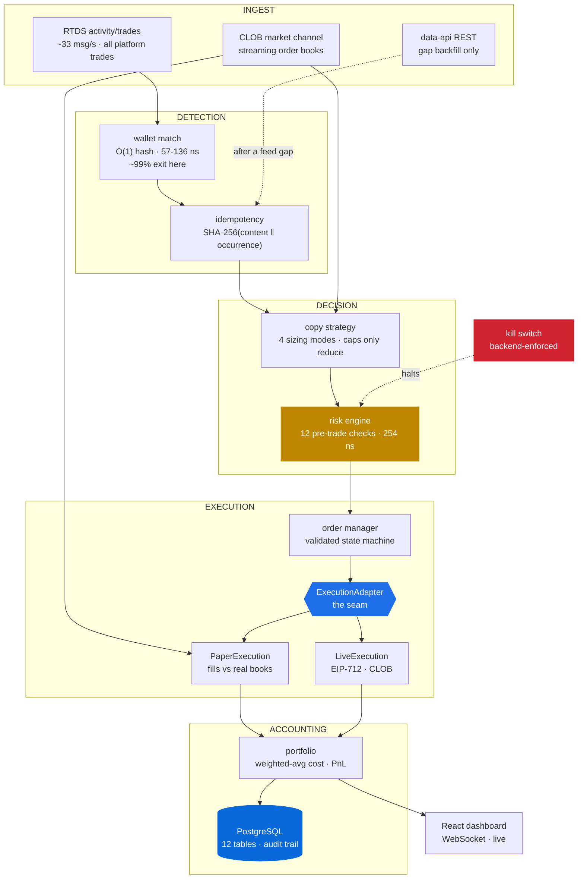
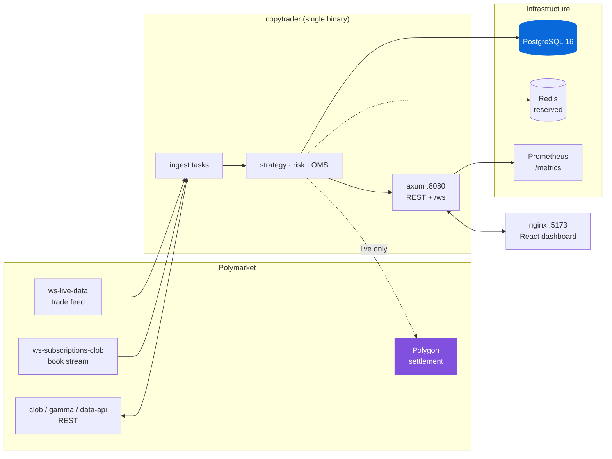

<div align="center">

# Polymarket Copy-Trading Engine

**An event-driven, low-latency copy-trading system for [Polymarket](https://polymarket.com), in Rust.**

Watches selected wallets, detects their trades in real time, sizes and risk-checks a mirrored
order, and executes it through **a paper simulator or the live CLOB behind one identical interface**.

[](https://www.rust-lang.org)
[](#testing)
[](#testing)
[](#engineering-standards)
[](#license)

</div>

---

## Table of contents

- [What makes this different](#what-makes-this-different)
- [Architecture](#architecture)
- [Quick start](#quick-start)
- [Paper mode](#paper-mode--simulated-execution-real-market-data)
- [Live mode](#live-mode--real-execution)
- [Strategy](#strategy)
- [Risk engine](#risk-engine)
- [Latency](#latency)
- [Does it actually make money?](#does-it-actually-make-money)
- [Infrastructure](#infrastructure)
- [Dashboard](#dashboard)
- [Testing](#testing)
- [Engineering standards](#engineering-standards)
- [Project status](#project-status)
- [Documentation](#documentation)

---

## What makes this different

Most integrations are written from documentation. This one was written from **measurement**,
and the measurements disagreed with the documentation in ways that would have silently
broken everything. Each finding below is reproducible via
[`scripts/verify_api.sh`](scripts/verify_api.sh).

### 1. There is a real-time, wallet-attributed trade feed — and no way to filter it

`wss://ws-live-data.polymarket.com`, subscribing to `activity/trades`, pushes **every trade
on the platform** with a `proxyWallet` field, unauthenticated, at **~33/sec**. This is what
makes a genuinely event-driven copy trader possible instead of a polling loop.

It has **no server-side wallet filter**. Three plausible filter spellings were each accepted
without error and then delivered **zero frames** — they silently break the subscription
rather than narrowing it. So the firehose is consumed whole and matched client-side, which is
why wallet matching is a single hash lookup (**57–136 ns**, flat in wallet count) executed
before any other work.

### 2. Polymarket publishes no unique identifier for a fill

Across 1,466 consecutive live trades: **587 distinct `transactionHash` values**, one
transaction carrying **16 fills**, and *byte-identical rows* inside a single transaction —
same wallet, side, asset, price and size.

```
tx 0x5acd4332…  0xe6F7E1Ab…  BUY  0.98  size 5
tx 0x5acd4332…  0xe6F7E1Ab…  BUY  0.98  size 5     ← genuinely two different fills
```

Every candidate business key is non-unique. Identity is therefore
`SHA-256(content ‖ occurrence)`, with the live feed and REST backfill deliberately treated
differently — [details](#idempotency-the-hard-part).

### 3. The deployed signing scheme is not the documented one

Public client libraries document EIP-712 domain `version = "1"` and an order struct with
`taker`, `expiration`, `nonce`, `feeRateBps`. **The deployed contract uses `version = "3"`
and none of those four fields exist.**

Signing from the docs produces `domainSeparator 0xa5745e87…` instead of `0x466c6391…` —
well-formed EIP-712, rejected every time, in a way indistinguishable from a network or
credentials fault. The real scheme was recovered from Polygon mainnet and **proved** by
recovering the signers of real settled orders → [`docs/SIGNING.md`](docs/SIGNING.md).

### 4. `data-api /trades` hides half the data by default

`takerOnly` defaults to **true**, returning one row per transaction — taker side only. A
target *providing* liquidity is invisible to REST but visible on the live feed.

| query | rows | distinct tx | max rows/tx |
|---|---|---|---|
| default | 1000 | 1000 | 1 |
| `takerOnly=false` | 1000 | **336** | **27** |

Backfill always sends `takerOnly=false`, or reconciliation silently disagrees with itself.

---

## Architecture

The central design rule: **one execution seam, everything above it identical.**



### The execution seam

```rust
#[async_trait]
pub trait ExecutionAdapter: Send + Sync {
    fn name(&self) -> &'static str;
    fn capabilities(&self) -> AdapterCapabilities;   // is_real_money lives here
    async fn is_ready(&self) -> bool;
    async fn submit(&self, order: &OrderRequest) -> Result<Acknowledgement, ExecutionError>;
    async fn cancel(&self, id: OrderId, venue_id: Option<&str>) -> Result<(), ExecutionError>;
    async fn positions(&self) -> Result<Vec<VenuePosition>, ExecutionError>;
    async fn poll_fills(&self) -> Result<Vec<Fill>, ExecutionError>;
}
```

Strategy, risk, the order manager and the portfolio are **byte-identical** across paper,
replay and live. That is not tidiness — it is what makes a paper result meaningful: the fill
travelled the same code path, through the same risk checks, in the same state machine, that a
live one would have.

### Crate layout

| Crate | Responsibility | LOC |
|---|---|---|
| `domain` | Types and invariants. No I/O. Decimal money, validated order state machine | ~1.5k |
| `config` | Typed config, the live interlock, redacted secrets | ~500 |
| `market_data` | Every Polymarket wire format and URL. Nothing else touches them | ~1.9k |
| `wallet_tracker` | Hot-path wallet matching, content+occurrence idempotency | ~700 |
| `strategy` | Copy signal generation, four sizing modes. Pure | ~700 |
| `risk` | 12 pre-trade checks, limits, kill switch | ~900 |
| `execution` | The adapter seam, paper/live, OMS, reconciliation, EIP-712 signing | ~2.7k |
| `simulator` | Fill simulation against real books | ~400 |
| `portfolio` | Positions, weighted-average cost, realised/unrealised PnL | ~500 |
| `persistence` | Postgres schema, repositories, crash recovery | ~900 |
| `api` | HTTP + dashboard WebSocket | ~1.1k |
| `metrics` | Prometheus, latency percentiles, health | ~700 |
| `app` | Wiring, background tasks, demo, replay, benchmarks | ~2.5k |

Full walkthrough → [`docs/ARCHITECTURE.md`](docs/ARCHITECTURE.md)

---

## Quick start

### Requirements

| | Version | Needed for |
|---|---|---|
| Rust | 1.82+ | backend |
| Node | 20+ | dashboard |
| Docker | any recent | Postgres + Redis (optional) |
| PostgreSQL | 16 | persistence (optional — degrades gracefully) |

### Zero-setup demo — no credentials, no database, no network

```bash
git clone https://github.com/pranay123-stack/polymarket-copy-trading-hft-rust.git
cd polymarket-copy-trading-hft-rust

cargo run --release -- --mode paper --demo
```

In a second terminal:

```bash
cd dashboard && npm install && npm run dev     # http://localhost:5173
```

The dashboard immediately shows simulated wallets, source trades, copied trades, fills,
positions, PnL, latency percentiles and risk events. All synthetic data is labelled `DEMO`
and is **refused outright in live mode**.

### Everything containerised

```bash
docker compose up
```

Starts PostgreSQL, Redis, the backend (paper + demo) and the dashboard on
`http://localhost:5173`. Migrations run automatically on connect. The default is safe by
design: `docker compose up` with no configuration cannot touch real funds.

### Compile / build / verify

```bash
cargo build --workspace                # debug
cargo build --workspace --release      # optimised (LTO, codegen-units=1)
cargo test  --workspace                # 341 tests, ~9s, no network or DB required
cargo clippy --workspace -- -D warnings
cargo run --release -- --check         # validate configuration and exit

cd dashboard && npm run build          # tsc + vite
./scripts/verify_api.sh                # re-verify every Polymarket API claim
```

---

## Paper mode — simulated execution, real market data

```bash
cp .env.example .env                              # defaults are safe and conservative
cargo run --release -- --mode paper
```

Paper mode connects to the **real** RTDS feed and the **real** CLOB order books. Only
execution is simulated.

### It is not a rubber stamp

Orders are matched against the same books the live strategy prices against:

- marketable orders **sweep real levels** and receive the true volume-weighted price
- a book too thin produces a **partial** fill, not a full one
- resting orders fill only when the market **genuinely trades through** them (marked `is_maker`)
- configurable fees, adverse slippage and rejection probability
- **submitting with no cached book is refused, never filled** — the failure mode this guards
  against is a paper engine that fills everything

Simulated latency is a real `sleep`, so latency is measured identically in paper and live
rather than substituted with a constant. Defaults are deliberately pessimistic: a paper fill
should be *harder* to get than a live one.

### Reproducibility

```bash
SIM_RNG_SEED=42 cargo run --release -- --mode paper
```

Fix the seed and an entire session replays identically — same fills, same partials, same
rejections. A paper run that cannot be reproduced is not evidence.

### Replay a recorded session

```bash
cargo run --release -- --mode replay --file ./tests/fixtures/session.json
```

The bundled fixture is **120 real captured Polymarket trades**. Replay auto-registers the
wallets in the recording (a session names its own cast), preserves the original event
spacing, and re-stamps timestamps at processing time so latency figures stay real.

### Observed on a real-data paper session

```
frames examined : 5,958        (real platform firehose)
wallet matches  : 107
copies          : 3 FILLED, 1 PARTIALLY_FILLED, 3 REJECTED (slippage — correctly)
positions       : 3 real positions at real entry prices
slippage        : +10bps, +267bps, −23bps vs the source fill
```

→ [`docs/PAPER_MODE.md`](docs/PAPER_MODE.md)

---

## Live mode — real execution

> **Live mode moves real money. Read [`docs/LIVE_MODE.md`](docs/LIVE_MODE.md) first.**

### Two independent switches

`APP_MODE=live` alone does nothing:

```bash
APP_MODE=live
LIVE_TRADING_ENABLED=true      # second, independent switch
```

Either alone is refused. The guard exists so a single forgotten variable can never arm real
trading, and it is enforced **twice** — in config validation and again in the risk engine.

```console
$ APP_MODE=live cargo run --release -- --check
Error: refusing to start LIVE execution: APP_MODE=live requires LIVE_TRADING_ENABLED=true
       (both must be set independently; this guard exists so a single missing variable
        cannot arm real trading)
```

### Required credentials

```bash
POLYMARKET_PRIVATE_KEY=      # EIP-712 (L1) order signing — never logged
POLYMARKET_FUNDER_ADDRESS=   # your proxy wallet; also used for reconciliation
POLYMARKET_API_KEY=          # L2 HMAC
POLYMARKET_API_SECRET=
POLYMARKET_API_PASSPHRASE=
API_AUTH_TOKEN=              # required: an unauthenticated kill switch is unacceptable
```

Missing any of them is a startup error naming exactly what is absent. `DEMO_DATA=true` is
rejected outright in live mode.

### Extra guards live mode applies

| Guard | Effect |
|---|---|
| `MAX_LIVE_ORDER_USD` (default \$50) | tighter per-order cap **on top of** global limits |
| `require_market_data` | refuses to trade without a fresh book |
| startup readiness check | any gap → error + **kill switch engaged**; API still comes up for inspection |
| reconciliation | position mismatch → halt and cancel |

### Run it

```bash
cargo run --release -- --check     # validate first
./scripts/verify_api.sh            # confirm API assumptions still hold
cargo run --release -- --mode live
curl localhost:8080/api/mode       # "am I live?" answered in one call
```

Start with `MAX_LIVE_ORDER_USD=5`, one target wallet, and a low `MAX_DAILY_LOSS_USD`.
Confirm reconciliation reports clean before raising anything.

### What is proven and what is not

**Proven:** the EIP-712 signing scheme, recovered from Polygon mainnet and verified by
recovering the signers of three real settled orders with two distinct keys. Signing is
RFC 6979 deterministic, so a retry cannot create a second distinct order.

**Not proven — needs a funded account:** whether `POST /order` *accepts* the signature, the
L2 HMAC message construction, the success-response shape, cancellation semantics, and
`GET /data/trades`. Every unverified detail is marked `// UNVERIFIED:` inline and confined to
`crates/execution/src/live.rs`.

---

## Strategy

### Signal generation

A detected source trade becomes a `CopySignal` carrying the full audit chain:
`source_event_id → correlation_id → signal_id → order_id → fill_id`.

The reference price is the **live touch on the side we would trade**, not the source
trader's fill. On a ~400ms-delayed feed the source's price is already history; pricing
against it would systematically overstate what is achievable.

### Sizing modes

| Mode | Formula |
|---|---|
| `FixedRatio` | `copy = target_notional × ratio` |
| `FixedUsd` | fixed notional, regardless of the target's size |
| `PortfolioPercent` | `copy = equity × pct` |
| `RiskAdjusted` | ratio-based, then scaled by position fill, liquidity and remaining daily risk |

Every mode funnels through one path, then a fixed sequence of caps:

```
raw notional → wallet max trade → global max trade → position headroom
             → wallet exposure  → remaining daily risk → liquidity (risk-adjusted only)
             → minimum floor (or refuse)
```

**Caps can only reduce, never increase.** Shares are derived at the *worst acceptable*
price and rounded **down** to the venue's size increment, so rounding can never breach a
notional cap. The binding constraint is recorded on the signal, so a systematically
undersized copy is visible rather than mysterious.

### Idempotency — the hard part

One source fill must produce **at most one** order. With no unique key available, identity is
`SHA-256(txHash ‖ trader ‖ token ‖ side ‖ price ‖ size ‖ occurrence)`. Because `txHash` is
part of the content, ordinals are scoped to one transaction and stay bounded.

The two delivery paths get **different rules**, and conflating them is the bug this design
exists to prevent:

| Path | Rule | Why |
|---|---|---|
| Live feed | each arrival takes the next ordinal | an identical row genuinely *is* a second fill |
| REST backfill | claims ordinals from 0; already-held ones are duplicates | overlap after a reconnect is the *same* fill |

Probing for a free ordinal on both paths would look symmetric and be wrong — a re-delivered
fill would take a fresh ordinal and be copied twice.

A ceiling (`MAX_OCCURRENCES_PER_CONTENT = 64`, ≈4× the worst production case) bounds
malformed input. Measured: a 50,000-row re-delivery storm produced **49,999 orders before
the ceiling and 63 after**, with the remainder reported rather than swallowed.

Protection is enforced **twice** — in memory, and by the database (`source_events.event_id`
PRIMARY KEY plus a UNIQUE on the content tuple), so a restart or a race surfaces as a
constraint violation instead of a duplicate order.

---

## Risk engine

**Every order passes `RiskEngine::check` before submission**, and the order state machine
makes that structural: `Submitted` is only reachable from `Validated`, and only the risk
engine issues that transition. Bypassing risk is not a matter of discipline.

Checks run cheapest and most categorical first, so an order halted by the kill switch never
reaches liquidity maths. The reported rejection is always the **first** limit breached — the
one an operator should act on.

| # | Check | Code |
|---|---|---|
| 1 | Kill switch engaged | `kill_switch` |
| 2 | Live mode armed | `live_not_armed` |
| 3 | Subsystem health | `system_unhealthy` |
| 4 | Source event already processed | `duplicate_order` |
| 5 | Wallet enabled | `wallet_disabled` |
| 6 | Market tradable | `market_not_tradable` |
| 7 | Daily loss limit | `daily_loss_limit` |
| 8 | Open order slots | `max_open_orders` |
| 9 | Trade size floor / ceiling (+ tighter live cap) | `below_min_order_size`, `max_trade_size` |
| 10 | Projected token / market / portfolio exposure | `max_position`, `max_market_exposure`, `max_portfolio_exposure` |
| 11 | Market data freshness | `stale_market_data` |
| 12 | Liquidity and expected slippage | `insufficient_liquidity`, `slippage_too_wide` |

Exposure projections assume a **full fill** — the conservative direction.

### Two deliberate non-behaviours

**A database outage does not stop trading.** Losing durable audit is degraded; halting a live
book over it is worse. Reported as `DEGRADED`, loudly, and trading continues.

**Ordinary limit hits do not engage the kill switch.** Only breaches indicating the *system*
is unwell do — the daily loss limit, and a reconciliation mismatch in live mode. Otherwise one
oversized signal would halt everything.

### Kill switch

Backend-enforced, inside the risk engine, on the path every order must traverse. The
dashboard can trigger and display it; disabling the dashboard cannot re-enable trading.

```bash
curl -X POST localhost:8080/api/risk/kill-switch \
  -H "Authorization: Bearer $API_AUTH_TOKEN" \
  -d '{"reason":"manual halt","cancel_open_orders":true}'
```

Engaging is always permitted, never fails, and is idempotent — a second engage keeps the
*original* reason, because the first cause is the diagnostically useful one. Disengaging is a
separate, explicit, attributed action.

→ [`docs/RISK.md`](docs/RISK.md)

---

## Latency

### Measured, never fabricated

Stages with no observations report **nothing** — not zero. Negative deltas (a clock stepping
backwards) are dropped, not clamped. Percentiles are nearest-rank over a bounded ring of
4,096 recent samples, so every figure is a **real observation**.

### Full-chain breakdown, live paper session

| Stage | p50 | What it is |
|---|---|---|
| `detection` | **330–400 ms** | venue publish → our ingest — *Polymarket's, not ours* |
| `strategy` | **0.047 ms** | ingest → signal (sizing, pricing) |
| `risk` | **0.114 ms** | 12 pre-trade checks |
| `submission` | **0.006 ms** | verdict → on the wire |
| **`internal`** | **0.19 ms** | **ingest → wire — the part we own** |
| `ack` | 52–60 ms | wire → venue accept (simulated venue) |
| `end_to_end` | 440–730 ms | venue publish → fill |

Splitting `detection` from `internal` is deliberate: reporting only end-to-end would hide a
3× regression in our own code behind the venue's 400 ms.

### Component benchmarks

`cargo bench -p app --bench pipeline` — criterion medians:

| Component | Median |
|---|---|
| RTDS frame parse | 2.39 µs |
| wallet match, miss (1 / 10 / 100 wallets) | 57 / 136 / 108 ns |
| dedup identity hash | 787 ns |
| copy sizing | 376 ns |
| **full risk check (12 checks)** | **254 ns** |
| book sweep VWAP (depth 5 / 50 / 500) | 519 ns / 843 ns / 1.01 µs |
| parse + normalise 100-level book | 23.4 µs |
| portfolio apply fill | 691 ns |

Wallet matching is **flat in the number of tracked wallets** — firehose cost does not grow as
more traders are copied.

### Throughput

```
cargo test -p app --release --test load_test -- --ignored --nocapture

200,000 source events, 20 tracked wallets
  events/sec        : 230,520
  detect + dedup    : p50 172 ns   p99 3,640 ns
  risk check        : p50 331 ns   p99   814 ns
  headroom vs live  : ~7,000× (feed measured ~33 msg/s)
```

### An honest caveat about "HFT"

The code is fast. But **latency is not the binding constraint here**, and saying otherwise
would be marketing rather than engineering:

- Polymarket publishes trades ~400 ms after they happen. Our 0.19 ms is **0.05%** of
  end-to-end; we cannot fix the other 99.95%.
- Measured on the tightest, most liquid books: across **198 snapshot pairs over ~55 s the top
  of book changed 0 times**. Being 400 ms late cost nothing in price terms.

Being 10× faster would change almost nothing. What eats returns is spread — see below.

→ [`docs/LATENCY.md`](docs/LATENCY.md)

---

## Does it actually make money?

**No evidence that it does, and the measured cost structure is hostile.** Stated plainly
because a portfolio project that overclaims is worth less than one that measures.

### The hurdle — 60 active markets sampled

| Spread (bps of mid) | p10 | p25 | median | p75 | p90 |
|---|---|---|---|---|---|
| full spread | 44 | 114 | **241** | 923 | 1818 |
| cost to cross (half) | 22 | 57 | **120** | 462 | 909 |

Half of sampled markets use a `0.01` tick — at price 0.50 one tick **is** 200 bps, so those
markets cannot be tighter than ~2%. Observed fees were **0 bps**; fees are not the problem.

### The follower penalty — replay of 120 real trades, 20 fills

```
realized PnL          : -$0.61
slippage vs the source: median +30 bps, mean +25 bps
paid MORE than the trader we copied on 19 of 20 copies
```

You buy what someone else just bought, into the liquidity they did not take. ~25–30 bps per
copy, systematically.

### What would have to be true

```
target's edge  >  half-spread in (~120 bps)  +  half-spread out (~120 bps)
               +  follower slippage (~25-30 bps)  +  adverse move in the lag (≈0)
```

**The target's edge must exceed roughly 2.7% per round trip** on a median market. Few
systematic edges are that large. It is only plausible where the target holds to resolution
(one spread, not two), in unusually tight markets, with a large slow edge.

That is a **selection problem, not a speed problem** — which wallets, which markets, what
minimum size. The system exposes exactly those levers (`min_source_notional_usd`,
`MAX_SLIPPAGE_BPS`, `MIN_LIQUIDITY_USD`, per-wallet allow-lists) and nobody has tuned them
against weeks of data yet.

→ [`docs/ECONOMICS.md`](docs/ECONOMICS.md)

---

## Infrastructure



### Persistence — 12 tables, 41 indexes

`target_wallets` · `markets` · `source_events` · `copy_signals` · `orders` · `fills` ·
`positions` · `pnl_snapshots` · `risk_events` · `system_events` · `latency_metrics` ·
`audit_logs`

Migrations apply automatically and idempotently on connect. A single trade is traceable
end to end:

```sql
SELECT se.event_id, cs.copy_notional, o.state, f.quantity, f.price
FROM source_events se
JOIN copy_signals cs ON cs.source_event_id = se.event_id
JOIN orders       o  ON o.correlation_id   = se.correlation_id
LEFT JOIN fills   f  ON f.order_id         = o.order_id
WHERE se.correlation_id = $1;
```

### Runs without a database

```bash
EPHEMERAL_STORAGE=true cargo run --release -- --mode paper --demo
```

Every repository call becomes a no-op and trading continues. Crash recovery and durable audit
are unavailable, and health reports `database: DEGRADED` with the reason rather than implying
otherwise. The system falls back to this automatically if Postgres is unreachable.

### Crash recovery

On startup, in this order:

1. **rebuild the dedup index** from `source_events` — first, because it is what stops a
   replayed feed re-copying old trades
2. restore positions, cash, realised PnL and fees from the latest snapshot
3. restore target wallets
4. load orders that were still working and **flag any that may have executed** for
   reconciliation

Verified: after a kill and restart, the dedup index, positions and exact cash were all
restored.

### Observability

```bash
curl localhost:8080/api/health     # liveness/readiness
curl localhost:8080/api/mode       # is real money at stake?
curl localhost:8080/metrics        # Prometheus
```

Alerts worth wiring: `kill_switch_engaged == 1`,
`reconciliation_mismatches_total` increasing, `feed_connected == 0`,
`risk_rejections_by_reason{reason="daily_loss_limit"} > 0`.

> **Feed liveness is measured by data arriving, not by the socket being open.** The RTDS feed
> was observed connecting and then delivering nothing for minutes. A health check keyed on
> connection state reported HEALTHY throughout — because every reconnect refreshed it. It now
> reports `connected but silent for Ns`.

→ [`docs/DEPLOYMENT.md`](docs/DEPLOYMENT.md)

---

## Dashboard

React 18 · TypeScript · Vite · Tailwind · Recharts. Dark trading-terminal UI, live over
WebSocket.

| Panel | Shows |
|---|---|
| **Overview** | mode banner, equity, PnL, exposure, latency, copied trades vs source trades |
| **Copy Trades** | target wallet, source size, copied size, both prices, slippage, latency, status |
| **Positions** | quantity, average entry, mark, exposure, unrealised/realised/total PnL |
| **Orders** | full lifecycle with per-stage latency and reject reasons |
| **Wallets** | add / enable / disable / remove, per-wallet PnL |
| **Risk** | limit utilisation meters, rejections by reason, risk events, kill switch |
| **Latency** | per-stage min / mean / p50 / p95 / p99 / max |

Design details that matter:

- a live book gets an **unmissable red banner**; `real_money` comes from the adapter itself
- `unrealized_pnl: null` renders as **"unmarked"**, not `$0.00` — an unmarked book must never
  look flat
- a slow client **lags and skips** rather than applying backpressure; the server sends a
  `lagged` notice and the UI resyncs from REST. A browser tab must never slow down order
  handling

---

## Testing

```bash
cargo test --workspace                                             # 341 tests, ~9s
cargo test -p app --release --test load_test -- --ignored --nocapture
cargo bench -p app --bench pipeline
./scripts/verify_api.sh                                            # live API claims
cargo run -p wallet_tracker --example live_ingest_smoke             # real feed → tracker
```

`cargo test` is **hermetic** — no network, no database.

### Tests that encode a hard-won fact

| Test | Guards against |
|---|---|
| `book_is_normalised_to_best_first` | the venue sorts **both** sides worst-first; `bids[0]` is the *worst* bid |
| `mixed_case_addresses_from_rtds_still_match` | RTDS sends EIP-55, data-api sends lowercase → silently matches nothing |
| `genuinely_identical_live_fills_are_both_copied` | collapsing them under-copies the target |
| `redelivered_fill_produces_exactly_one_order` | backfill overlap double-trading |
| `backfill_reconciles_against_the_live_feed_as_a_multiset` | 2 seen + 3 reported = 1 new |
| `a_repeat_storm_is_capped_rather_than_copied_unbounded` | malformed input minting 49,999 orders |
| `recovers_the_signer_of_a_real_settled_order` | the deployed EIP-712 scheme changing |
| `documented_version_one_would_produce_the_wrong_domain` | signing from the docs and being silently rejected |
| `ambiguous_submission_becomes_unknown_not_failed` | a timeout being treated as "no order" → lost position |
| `venue_overfill_is_refused_and_flagged` | a bogus fill entering the position |
| `submitting_without_market_data_refuses_instead_of_inventing_a_fill` | the paper-engine-fills-everything failure |
| `simulated_latency_is_actually_elapsed_not_faked` | fabricated latency metrics |
| `skipping_risk_validation_is_impossible` | `CREATED` reaching `SUBMITTED` |
| `unexpected_venue_position_always_warrants_a_halt` | exposure in a market we do not know about |
| `every_mutating_route_is_protected` | a new endpoint escaping an auth decision |
| `unmeasured_stages_report_nothing` | inventing a plausible zero |
| `hmac_matches_rfc4231_vector` | a hand-rolled HMAC being assumed correct |

→ [`docs/TESTING.md`](docs/TESTING.md)

---

## Engineering standards

| | |
|---|---|
| `unsafe` | **none** |
| Build warnings | **0** |
| `unwrap`/`expect` in production paths | 9, all on compile-time-known-valid input, each annotated |
| Money arithmetic | `rust_decimal` throughout; floats only at the ingest boundary, via shortest round-trip string |
| Direction | `Side` enum — `Qty` cannot be negative |
| Order state | validated enum with an explicit transition table |
| Absent measurements | `Option`, never a plausible zero |
| Secrets | behind `Secret`, whose `Debug`/`Display` are redacted (so `tracing` cannot leak them) |
| Auth | constant-time comparison; live mode refuses to start without a token |
| Container | non-root (uid 10001), no shell |

→ [`docs/SECURITY.md`](docs/SECURITY.md)

---

## Project status

| Track | Complete | Basis |
|---|---|---|
| **Paper on real Polymarket data** | **~98%** | full loop proven live; books streamed; Postgres verified |
| **Ready for live testing** | **~85%** | signing recovered and cryptographically proven |

**Working and verified against production:** paper, replay and demo modes; streamed order
books; copy strategy with four sizing modes; the full risk engine and kill switch; the paper
simulator; portfolio and PnL; the HTTP API and dashboard WebSocket; Prometheus metrics;
Postgres persistence with crash recovery; EIP-712 order signing.

**Needs a funded account — verification, not construction:**

1. Confirm `POST /order` *accepts* a signature from this module
2. Confirm the L2 HMAC message construction against an authenticated `200`
3. Confirm the `POST /order` success body → `venue_order_id` extraction
4. Confirm cancellation semantics
5. Confirm `GET /data/trades` → implement `poll_fills`

**Known limitations:** the first-ever trade in a market outside the warm set pays one REST
book fetch (~200 ms, bounded to once per market); Redis is configured but unused;
`signatureType = 3` — now dominant on chain — is a delegated/session-key scheme this project
deliberately does not attempt.

→ [`docs/STATUS.md`](docs/STATUS.md)

---

## Documentation

| Document | Contents |
|---|---|
| [`POLYMARKET_API.md`](docs/POLYMARKET_API.md) | Every verified API fact, with the evidence |
| [`SIGNING.md`](docs/SIGNING.md) | The deployed EIP-712 scheme, recovered and proved |
| [`ARCHITECTURE.md`](docs/ARCHITECTURE.md) | Components, data flow, design decisions |
| [`EXECUTION.md`](docs/EXECUTION.md) | The adapter seam and the order state machine |
| [`RISK.md`](docs/RISK.md) | The 12 checks, limits, kill switch, idempotency |
| [`ECONOMICS.md`](docs/ECONOMICS.md) | Measured spreads, follower slippage, can this pay? |
| [`PAPER_MODE.md`](docs/PAPER_MODE.md) | The simulation model and its parameters |
| [`LIVE_MODE.md`](docs/LIVE_MODE.md) | Arming live, and exactly what remains |
| [`LATENCY.md`](docs/LATENCY.md) | What is measured and what the numbers mean |
| [`API.md`](docs/API.md) | Endpoints, auth, WebSocket protocol |
| [`TESTING.md`](docs/TESTING.md) | Test strategy and how to run everything |
| [`DEPLOYMENT.md`](docs/DEPLOYMENT.md) | Docker, migrations, operations |
| [`SECURITY.md`](docs/SECURITY.md) | Secrets, auth, threat model |
| [`STATUS.md`](docs/STATUS.md) | Honest completion state |

---

## License

MIT

---

<div align="center">

**Built by measuring the venue, not by reading about it.**

Every number in this README came from a run you can reproduce.

</div>
